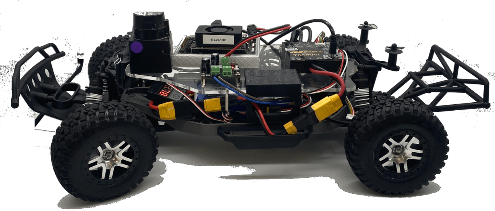
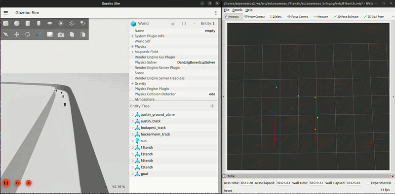

# Autonomous F1tenth Gym v2.0
Using reinforcement learning techniques to drive the f1tenth vehicle platform - head-to-head and time trial racing!



# Installation Instructions
Follow these steps to set up the Autonomous F1tenth Gym v2.0 on your system. The instructions below will guide you through installing all required dependencies, cloning the necessary repositories, and building the workspace to get started with simulation and reinforcement learning.

## Dependencies
Before proceeding, ensure your system meets the following software requirements. These dependencies are essential for running the simulation environment and reinforcement learning workflows. Follow the provided links for installation instructions and version details.

## Gazebo Garden  (source)
We source build Gazebo Garden, and use a forked `gz-sim` that fixes some issues with Ackermann control in the base version. Follow the instructions for installing Gazebo Garden from source [here](https://gazebosim.org/docs/garden/install_ubuntu_src) then follow the instructions below to replace 'gz-sim' with our custom version.

```
cd ~/workspace/src
rm -rdf gz-sim
git clone https://github.com/UoA-CARES/gz-sim.git
cd ~/workspace
colcon build --merge-install
echo "source ~/workspace/install/setup.bash" >> ~/.bashrc
source ~/.bashrc
```

## ROS 2.0 Humble
Follow the instructions to install ROS 2.0 Humble from the main installation instructions: [Humble Hawksbill](https://docs.ros.org/en/humble/Installation.html).

## CARES Reinforcement Learning
The CARES RL package provides the primary set of training algorithms and tools for reinforcement learning with the F1tenth Gym. While the gym environment is compatible with other custom RL frameworks or scripts, CARES RL offers a streamlined interface and ready-to-use implementations for most users. Note that CARES RL is not a strict installation dependency for the gym itself, but is recommended for standard training workflows.

Follow the instructions to install the CARES Reinforcement Learning package from the main installation instructions: [CARES RL v3.1.0](https://github.com/UoA-CARES/cares_reinforcement_learning/tree/V3.1.0).

## Package Installation
Follow these instructions to run/test this repository on your local machine. Ensure you have installed the dependencies outlined above.

These instructions assumne you are using '~/ros2_ws/src' as your ROS2 workspace. Please adjust those commands as required if you are using a different workspace folder.

Clone the autonomous_f1tenth repository.
```
cd ~/ros2_ws/src
git clone https://github.com/UoA-CARES/autonomous_f1tenth.git
```

Clone the `f1tenth` repository as a sibling workspace package (outside this repository).

```
cd ~/ros2_ws/src
git clone --recurse-submodules https://github.com/UoA-CARES/f1tenth.git
```

Install dependencies using `rosdep`

```
cd ~/ros2_ws
rosdep update -y
rosdep install --from-paths src --ignore-src -r -y --rosdistro humble
```

Colcon build the package

```
cd ~/ros2_ws
colcon build --symlink-install
echo "source ~/ros2_ws/install/setup.bash" >> ~/.bashrc
source ~/.bashrc
```

# Quick Start

To run and view RL training, use up to four separate terminals (one command per terminal):



**1. Launch the simulation environment:**

This starts the simulation with the selected task and track. Only `environment`, `track`, and `num_opponents` are configurable. The car name is always set to `f1tenth` and does not need to be changed.

```
ros2 launch f1tenth_bringup environment_bringup.launch.py environment:=CarRace num_opponents:=3
```

**2. Start RL training:**

The RL agent (e.g., CARES RL) will instantiate the environment using EnvironmentFactory and pass all RL/environment parameters via the config argument. Only car_name and track must be consistent with the launch file.

```
cares-rl train cli f1tenth --task CarRace SAC
```

**3. (Optional) View simulation in Gazebo:**

```
gz sim -g
```

**4. (Optional) Visualization with RViz**

To visualize the simulation and topics, launch RViz with the provided configuration:

```bash
ros2 launch f1tenth_bringup rviz.launch.py
```

The RViz configuration file is located at:
```
f1tenth_bringup/rviz/f1tenth_default.rviz
```
You can customize this file to suit your visualization needs.


## Running Multiple Instances in Parallel

To run multiple independent training or simulation instances on the same machine, set unique ROS and Gazebo communication domains for each instance (set of terminals for each run):

```bash
export ROS_DOMAIN_ID=42   
export GZ_PARTITION=42
```

You can use any integer value (e.g., 42, 43, 44, ...) as long as each parallel instance uses a different value. This ensures that ROS 2 and Gazebo messages do not interfere between runs.